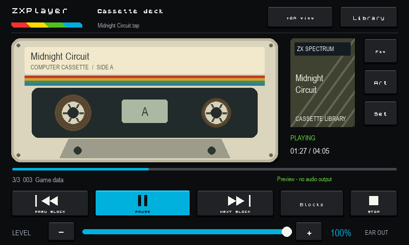
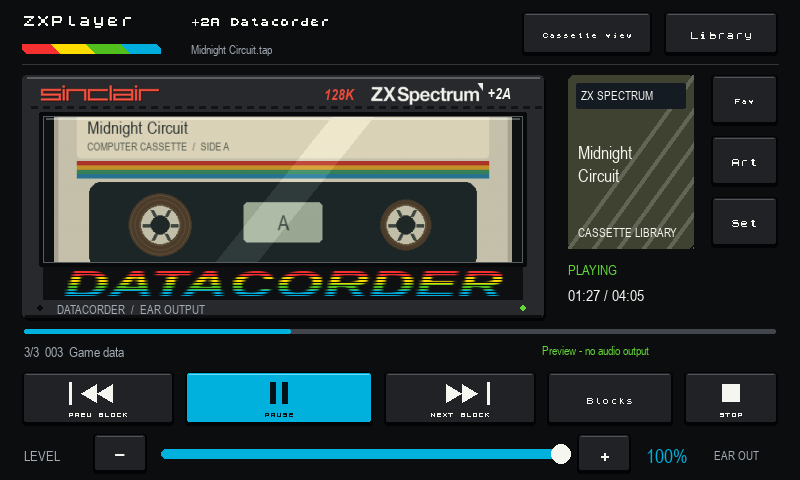
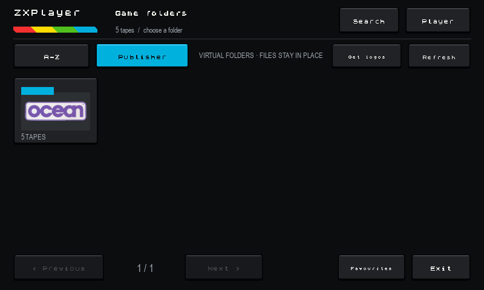

# ZXPlayer

ZXPlayer turns a Raspberry Pi into a touchscreen ZX Spectrum cassette player.
It renders supported tape images to audio for a real Spectrum's EAR socket and
provides touch-friendly cassette controls, animated reels, block navigation,
box artwork, publisher folders and optional controller support.



## Main features

- TAP, TZX, PZX, CSW, SPC, STA, LTP and WAV playback
- Play/Pause, previous block, next block, block list and stop
- Physical audio output through the Raspberry Pi headphone socket
- Cassette and ZX Spectrum +2A-inspired Datacorder views
- Animated cassette reels with per-image spindle alignment
- A-Z and publisher library folders
- Local box, tape and publisher artwork
- World of Spectrum Infoseek artwork and publisher-logo lookup
- Touch, keyboard and USB/Bluetooth game-controller input
- Designed for an 800 x 480 five-inch display




## Raspberry Pi installation

The current target is a Raspberry Pi 4 running 64-bit Raspberry Pi OS Trixie.
Copy or clone the repository to the Pi, then open a terminal in its folder and
run:

```sh
bash install-dependencies.sh
```

Put cassette files in `tapes`. Optional artwork belongs in `images/box`,
`images/tape` and `images/publishers`. Start ZXPlayer with:

```sh
python3 player.py
```

Audio defaults to the Raspberry Pi headphone output. Connect that output to the
Spectrum EAR input and retain a hardware volume setting that has loaded reliably
on the real machine. ZXPlayer's on-screen level supplies additional attenuation.

## Desktop launcher

Run this once from the ZXPlayer folder:

```sh
bash install-launcher.sh
```

ZXPlayer then appears in the Raspberry Pi application menu and as a desktop
icon. The launcher opens it full-screen without a terminal window. To launch it
automatically after desktop login, use:

```sh
bash install-launcher.sh --autostart
```

Remove the shortcuts without deleting ZXPlayer or its collection with:

```sh
bash uninstall-launcher.sh
```

## Collection privacy

The supplied `.gitignore` excludes tapes, downloaded artwork, cache data and
personal settings from Git. Check the changed-files list before every commit.
Do not publish commercial tape images or archive artwork unless you have the
right to redistribute them.

## Included data and marks

`artwork_catalog.json` is derived from ZXDB data; see `ZXDB-NOTICE.txt`.
ZX Spectrum Strict is distributed with its own GPL-3.0 notice and licence.
The fascia wordmarks have a separate notice in `DATACORDER-BRANDING-NOTICE.txt`.

## Licence

ZXPlayer source code is copyright 2026 ZXPlayer contributors and is free
software licensed under the GNU General Public License, version 3 or (at your
option) any later version (`GPL-3.0-or-later`). See `LICENSE`.

Bundled data, fonts and branding assets retain their respective licences and
notices. See `THIRD-PARTY-NOTICES.md`, `ZXDB-NOTICE.txt`,
`ZX-FONT-LICENSE.txt` and `DATACORDER-BRANDING-NOTICE.txt`.

ZXPlayer is an independent community project. It is not affiliated with or
endorsed by Sinclair, World of Spectrum, Spectrum Computing, or the respective
rights holders. ZX Spectrum, Sinclair, and related names and marks remain the
property of their respective owners.

More operating details are in `START-HERE.txt`.
